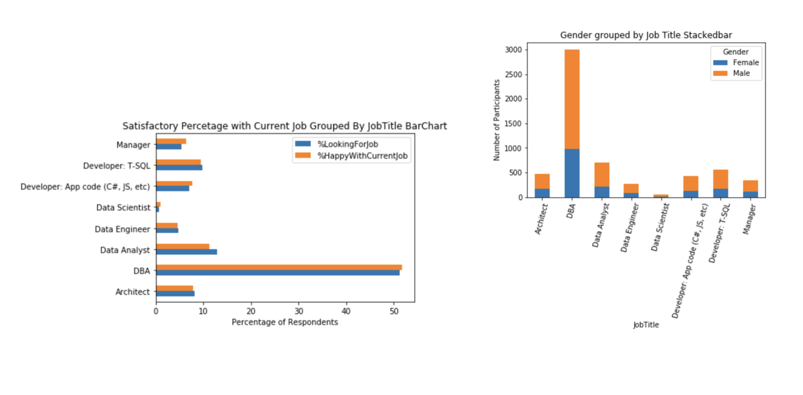
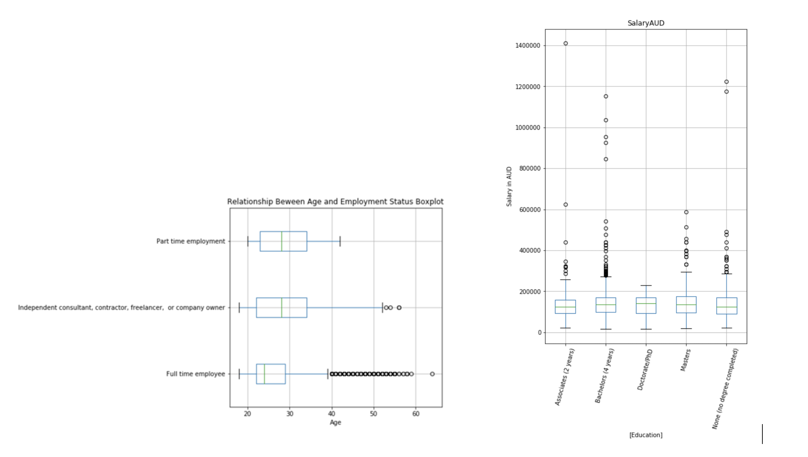
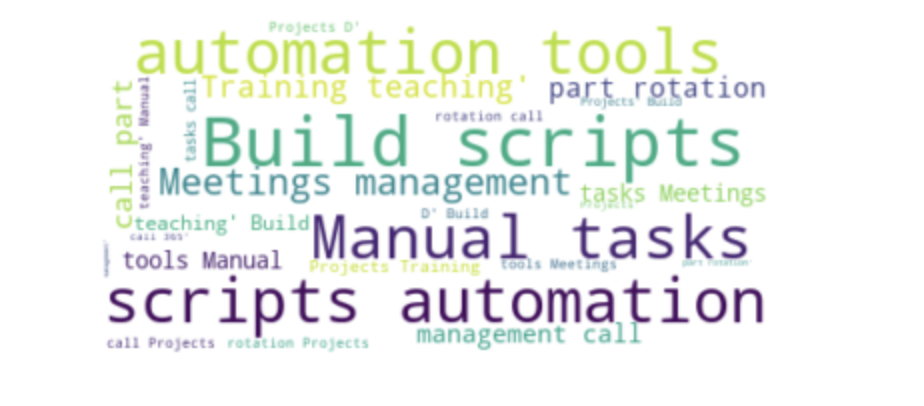

# Portfolio
---
## EXCEL

### Boston AirBNB Open Data

Clean and Analyse Data to Give AirBnb Recommendations as to Improve Host's Engagement and Services

---
## TABLEAU

### Console Video Games Sales Around the World (1980-2016)

 An interactive dashboard showing sales of all videos games around the world from 1980-2016
  
 

 

---

## PYTHON
  
### EDA public data set using Python's Pandas

Data: public data set resulted from a survey conducted in late 2018 for a large Australian collective of IT professionals (with 7000 responses). A thorough analysis of particiants' demographic, education, employment, salary, tasks &tools via EDA skills, primarily through visualisation using Python's Pandas. Data quality also was assessed.
 

 

  

© 2022 Powered by Jekyll and the Minimal Theme.

