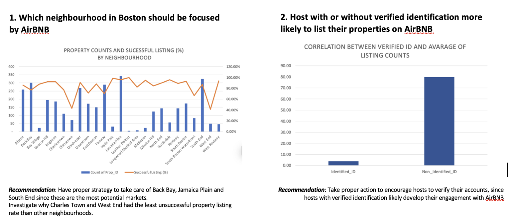
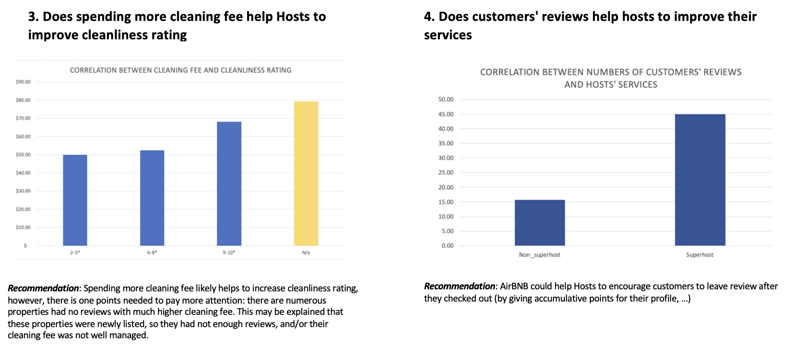
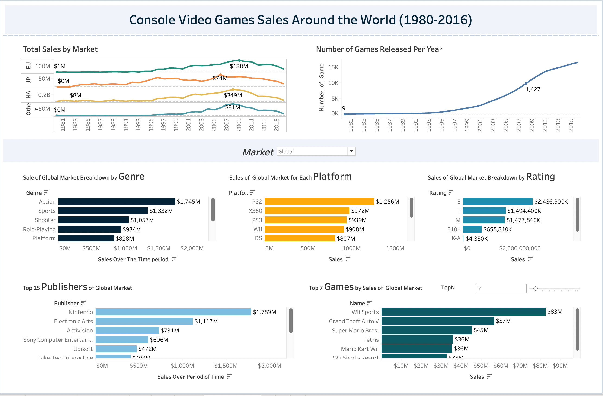

# Portfolio
---
## EXCEL

### Boston AirBNB Open Data

Clean and Analyse Data to Give AirBnb Recommendations as to Improve Host's Engagement and Services

---
## TABLEAU

### Console Video Games Sales Around the World (1980-2016)

 An interactive dashboard showing sales of all videos games around the world from 1980-2016
 

 

---
## PYTHON
### EDA public data set using Python's Pandas

[)](http://localhost:8888/notebooks/Downloads/Github/Python/DataScience_Python.ipynb))

Data: public data set resulted from a survey conducted in late 2018 for a large Australian collective of IT professionals (with 7000 responses).
 

 

---
### Predict Breast Cancer with RF, PCA and SVM using Python

In this project I am going to perform comprehensive EDA on the breast cancer dataset, then transform the data using Principal Components Analysis (PCA) and use Support Vector Machine (SVM) model to predict whether a patient has breast cancer.

 

 

---
### Business Analytics Conference 2018: How is NYC's Government Using Money?

In three-month research and a two-day hackathon, I led a team of four students to discover insights from 6 million records of NYC and Boston government spending data sets and won runner-up prize for the best research poster out of 18 participating colleges.

 

 

---
## Filmed by me

Besides Data Science, I also have a great passion for photography and videography. Below is a list of films I documented to retain beautiful memories of places I traveled to and amazing people I met on the way.

 

- [Ada Von Weiss - You Regret (Winter at Niagara)](https://www.youtube.com/watch?v=-5esqvmPnHI)
- [The Weight We Carry is Love - TORONTO](https://www.youtube.com/watch?v=vfZwdEWgUPE)
- [In America - Boston 2017](https://www.youtube.com/watch?v=YdXufiebgyc)
- [In America - We Call This Place Our Home (Massachusetts)](https://www.youtube.com/watch?v=jzfcM_iO0FU)

---

© 2020 Khanh Tran. Powered by Jekyll and the Minimal Theme.

